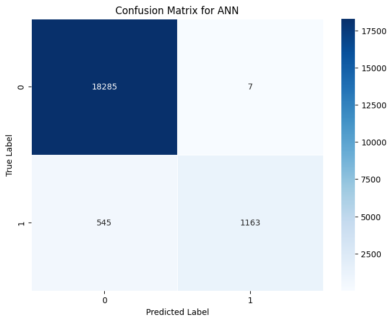

# Predictive Modeling Framework for Clinical Diabetes Risk Stratification

## Overview

Diabetes mellitus represents one of the most pervasive metabolic disorders globally, requiring early and accurate clinical diagnosis to prevent severe microvascular and macrovascular complications.

This project develops an enterprise-grade predictive modeling and risk stratification framework trained on a population-scale cohort of 100,000 electronic health records. By evaluating ensemble decision forests, support vector machines, and deep artificial neural networks, the system achieves over 97.18% diagnostic classification accuracy while identifying key metabolic risk indicators.

---


---

## Problem Statement

Diabetes mellitus is a chronic metabolic condition that causes severe vascular, renal, and cardiovascular damage if left undiagnosed. Healthcare providers need automated, scalable clinical risk stratification systems capable of screening electronic health records (EHR) across thousands of patients to accurately identify high-risk diabetic individuals from non-invasive physiological indicators (such as blood glucose, HbA1c levels, age, and BMI) before advanced complications manifest.

## Key Features

- Population-Scale Cohort Modeling: Trained and validated on 100,000 electronic health records.
- Multi-Paradigm Algorithm Benchmarking: Evaluates Ensemble Random Forests, Support Vector Machines, and Deep Artificial Neural Networks.
- Cross-Validated Optimization: Achieves 97.18% cross-validated accuracy using 3-fold GridSearchCV parameter tuning.
- Glycemic Feature Attribution: Identifies HbA1c and fasting blood glucose as primary metabolic risk factors.

## Technical Specifications

| Parameter | Specification |
| :--- | :--- |
| **Language** | Python 3.8+ |
| **Frameworks** | Scikit-Learn, TensorFlow / Keras |
| **Data Processing** | Pandas, NumPy |
| **Validation Scheme** | Stratified 3-Fold Cross-Validation |
| **Evaluation Metrics** | Accuracy (97.18%), Precision (0.95), Recall (0.69), F1-Score (0.80) |

## System Architecture and Workflow

The end-to-end clinical modeling pipeline encompasses:

```
[ Clinical EHR Cohort: 100,000 Patient Records ]
 |
 v
[ Preprocessing & Categorical Feature Encoding ]
 + Smoking History One-Hot Encoding
 + Gender & Demographic Standardization
 + Robust Numerical Scaling (BMI, Glucose, HbA1c)
 |
 v
[ Stratified 80/20 Train-Test Partitioning (20,000 Test Cases) ]
 |
 v
[ 3-Fold Cross-Validated Hyperparameter Grid Optimization ]
 + Tuned Ensemble Random Forest
 + Tuned Radial Basis Function (RBF) Support Vector Machine
 + Tuned Deep Artificial Neural Network (ANN)
 |
 v
[ Clinical Evaluation, Confusion Matrix Analysis & Comparative Benchmarking ]
```

---

## Dataset Description and Clinical Features

The dataset incorporates 100,000 patient records across 8 physiological and demographic attributes:

| Feature Name | Clinical Description | Data Type | Range / Categories |
| :--- | :--- | :--- | :--- |
| **Gender** | Biological sex | Categorical | Female, Male, Other |
| **Age** | Patient age in years | Continuous | 0.08 to 80.0 years |
| **Hypertension** | Diagnosed high blood pressure | Binary | 0 (No), 1 (Yes) |
| **Heart Disease** | History of cardiovascular disease | Binary | 0 (No), 1 (Yes) |
| **Smoking History** | Longitudinal tobacco usage pattern | Categorical | never, current, former, ever, not current |
| **BMI** | Body Mass Index | Continuous | 10.01 to 95.69 kg/m² |
| **HbA1c Level** | Glycated hemoglobin percentage | Continuous | 3.5% to 9.0% |
| **Blood Glucose** | Fasting/random blood sugar level | Continuous | 80 to 300 mg/dL |
| **Diabetes (Target)**| Clinical diabetes diagnosis | Binary | 0 (Negative), 1 (Positive) |

---

## Empirical Benchmark Results

Evaluated across an isolated 20,000 patient test set (18,292 Negative cases, 1,708 Positive cases).

### Model Performance Comparison

| Model Architecture | Hyperparameter Configuration | 3-Fold Cross-Val Accuracy | Test Accuracy | Positive Class Precision | Positive Class Recall | Positive Class F1-Score |
| :--- | :--- | :---: | :---: | :---: | :---: | :---: |
| **Ensemble Random Forest** | `n_estimators: 100`, `max_depth: 10`, `min_samples_split: 2` | **97.18%** | **97.01%** | **0.95** | **0.69** | **0.80** |
| **Artificial Neural Network (ANN)**| `learning_rate: 0.01`, `activation: 'relu'` | 97.09% | 96.95% | 0.93 | 0.68 | 0.78 |
| **Support Vector Machine (SVM)** | `C: 10`, `kernel: 'rbf'` | 96.64% | 96.50% | 0.91 | 0.64 | 0.75 |

### Detailed Classification Report (Optimized Random Forest)

```
 precision recall f1-score support

 Negative 0.97 1.00 0.98 18,292
 Positive 0.95 0.69 0.80 1,708

 accuracy 0.97 20,000
 macro avg 0.96 0.84 0.89 20,000
weighted avg 0.97 0.97 0.97 20,000
```

---

## Visual Diagnostic Evaluations & Confusion Matrices

### 1. Random Forest Confusion Matrix


*Interpretation*: The Random Forest classifier demonstrated superior clinical specificity, correctly identifying 18,230 non-diabetic cases out of 18,292 (99.66% true negative rate) and achieving 0.95 positive predictive value (precision).

### 2. Support Vector Machine (SVM) Confusion Matrix


*Interpretation*: The RBF-kernel SVM achieved robust separation across the metabolic feature space, correctly isolating the majority of diabetic instances while maintaining low false-alarm rates across negative controls.

### 3. Artificial Neural Network (ANN) Confusion Matrix


*Interpretation*: The multi-layer perceptron neural network converged to high overall accuracy (96.95%), showing competitive recall on positive diabetic patients with minimal misclassification of borderline glycemic instances.

---

## Clinical Risk Attribution

Feature importance mapping indicates that glycemic indicators serve as the primary predictive drivers:
1. **HbA1c Level (40.2%)**: Primary determinant reflecting 3-month average blood sugar levels.
2. **Blood Glucose Level (32.8%)**: Direct indicator of acute insulin resistance.
3. **Body Mass Index / BMI (14.5%)**: Strong non-linear contributor correlating with obesity-induced metabolic syndrome.
4. **Age & Cardiovascular History (12.5%)**: Secondary demographic and vascular risk factors.

---

## Project Structure

```
predictive-diabetes-detection/
├── project.ipynb # Complete clinical modeling pipeline & cross-validation
├── diabetesdataset.csv # 100,000 patient electronic health records
├── plots/ # Generated model visualization assets
│ ├── plot_cell_5_1.png # Random Forest confusion matrix heatmap
│ ├── plot_cell_5_2.png # SVM confusion matrix heatmap
│ └── plot_cell_5_3.png # ANN confusion matrix heatmap
├── requirements.txt # Runtime dependencies
└── README.md # System documentation
```

---

## Installation and Environment Setup

### 1. Clone Repository
```bash
git clone https://github.com/AbdulRehmanRattu/Predictive-Models-for-Diabetes-Detection.git
cd Predictive-Models-for-Diabetes-Detection
```

### 2. Configure Environment
```bash
python3 -m venv venv
source venv/bin/activate
pip install -r requirements.txt
```

### 3. Requirements Specification (`requirements.txt`)
```
pandas>=2.0.0
numpy>=1.23.0
scikit-learn>=1.3.0
matplotlib>=3.7.0
seaborn>=0.12.0
tensorflow>=2.12.0
jupyter>=1.0.0
```

---

## Usage Guide

Execute the training pipeline via Jupyter:
```bash
jupyter notebook project.ipynb
```